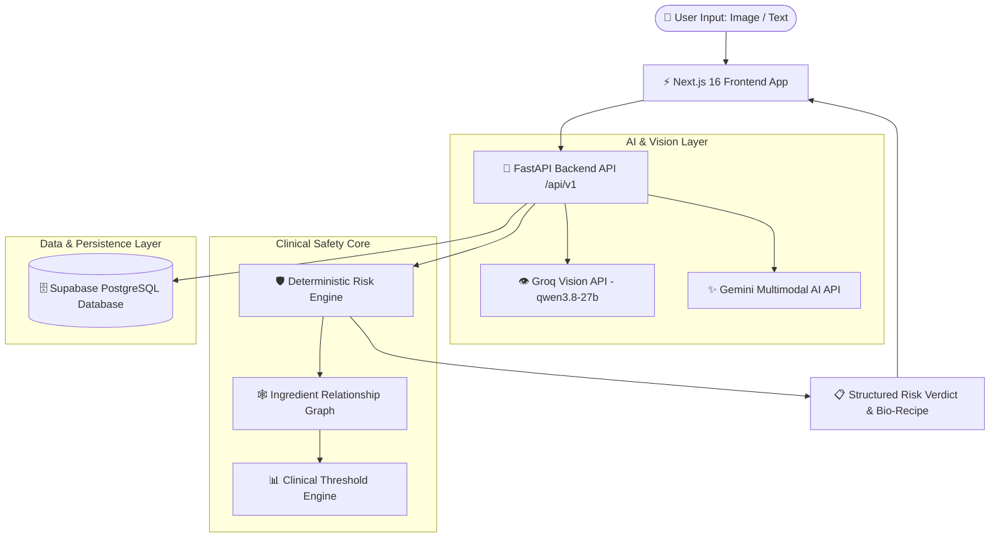

# 🌿 Swaahara — Botanical & Clinical AI Decision-Support Platform

> **Empowering Personal Dietary Health through Deterministic Risk Intelligence and Multimodal Vision AI.**

---

## 👥 Team Information

* **Team Name**: Gryffindor
* **Team Members**:
  * **Hariharan Malwad** 
  * **Manjushree Iyer** 
  * **Karthik Chettiar** 
  * **Thakshita Konar** 

---

## 📌 Table of Contents

1. [Executive Summary](#-executive-summary)
2. [The Problem Statement](#-the-problem-statement)
3. [The Swaahara Solution](#-the-swaahara-solution)
4. [System Architecture](#-system-architecture)
5. [Core Clinical Thresholds & Science](#-core-clinical-thresholds--science)
6. [Key Features](#-key-features)
7. [Technology Stack](#-technology-stack)
8. [Database Schema & Architecture](#-database-schema--architecture)
9. [Installation & Local Setup](#-installation--local-setup)
10. [API Documentation](#-api-documentation)

---

## 💡 Executive Summary

**Swaahara** (Swaa*hara*) is an end-to-end HealthTech decision-support platform designed to analyze food items in real time, detect hidden ingredient relationships (e.g. *groundnut* $\rightarrow$ *peanut allergy*, *whey/casein* $\rightarrow$ *dairy intolerance*, *fermented anchovy* $\rightarrow$ *histamine spike*), evaluate medical condition risks against strict clinical thresholds, and generate bio-compatible meal plans and recipes.

Unlike traditional fitness apps that only track calories, Swaahara combines **Multimodal AI (Groq & Gemini Vision)** with a **Deterministic Clinical Risk Engine** to ensure 100% medical accuracy without AI hallucinations.

---

## ⚠️ The Problem Statement

1. **Generic AI Hallucinations**: Standard LLMs (like ChatGPT) often hallucinate safety claims, dangerously telling diabetic or severely allergic patients that high-risk foods are safe.
2. **Hidden Culinary Derivatives**: Most consumers cannot identify hidden aliases on food labels (e.g., *casein*, *hydrolyzed vegetable protein*, *groundnut oil*).
3. **One-Size-Fits-All Nutrition**: Conventional health apps provide generic advice ignoring individual clinical conditions (Hypertension, Type 2 Diabetes, Histamine Intolerance, CKD, PCOS).

---

## 🛡️ The Swaahara Solution

Swaahara bridges the gap between **Generative AI** and **Medical Science**:

* **Vision AI**: Recognizes dish photos, package ingredient lists, and restaurant menus.
* **Deterministic Risk Engine**: Evaluates extracted ingredients against medical profile rules—**never guessing safety**.
* **Counterfactual Recipe Reformulation**: Automatically transforms risky dishes into 100% compatible versions (e.g. air-frying instead of deep-frying, monk fruit sweetener instead of sugar).
* **Full-Spectrum Tracker**: Calculates daily calories, macros, and vitamins while offering personalized clinical guidance.

---

## 🏗️ System Architecture



---

## 📊 Core Clinical Thresholds & Science

Swaahara enforces strict physiological boundaries based on international medical standards:

| Clinical Indicator | Safety Threshold | Medical Authority & Rationale |
| :--- | :--- | :--- |
| **Glycemic Load (GL)** | $\le 10$ per meal | **ADA (American Diabetes Association)** & Harvard Medical School standards for preventing postprandial glucose spikes. |
| **Sodium Threshold** | $< 400\text{ mg}$ per meal | **AHA (American Heart Association)** & ACC guidelines for managing blood pressure in Hypertension & CKD. |
| **Histamine Index** | Levels $0 \rightarrow 5$ Scale | **SIGHI (Swiss Interest Group Histamine Intolerance)** scale to prevent biogenic amine flare-ups. |
| **Allergen Exposure** | Zero-Tolerance ($0\%$) | **FDA FALCPA / FASTER Act** major allergen categories (Peanuts, Tree Nuts, Dairy, Eggs, Soy, Wheat, Fish, Shellfish, Sesame). |

---

## ✨ Key Features

### 1. 📸 Conversational AI Food Scanner
Upload dish photos, packaged food labels, or type prompts. Receives instant ingredient extraction and safety assessments.

### 2. ❓ Interactive Follow-Up Clarifications
When kitchen preparation methods are ambiguous (e.g. *Did the restaurant use fermented fish sauce or coconut aminos?*), Swaahara asks single-tap clarification questions to refine risk accuracy.

### 3. 🍳 Dynamic Bio-Compatible Recipe Generator
Generates dish-specific recipe modifications:
* **Cookies/Bakery**: Replaces refined flour with Oat & Coconut flour; sugar with Monk Fruit.
* **Savory Snacks (Vada Pav, Samosa)**: Replaces deep-frying with air-frying; potato with 50/50 cauliflower mash.
* **Asian Stir-Fries (Pad Thai)**: Replaces fish sauce with coconut aminos; peanuts with toasted pumpkin seeds.

### 4. 🔥 Daily Calorie & Micro-Nutrient Tracker
Logs breakfast, lunch, snacks, and dinner. Computes total calories, protein, carbs, fat, fiber, and micronutrients (Vitamins A/C/D/B12, Calcium, Iron, Sodium, Potassium) alongside clinical health scores.

### 5. 📅 AI Protocol Schedule & Weekly Table
Generates multi-day meal plans filtered against personal medical constraints.

### 6. 👤 Comprehensive Clinical Profile Intake
Multi-step medical intake covering conditions, allergies, intolerances, dietary patterns, activity levels, eating locations, and physician instruction upload support.

---

## 🛠️ Technology Stack

* **Frontend**: Next.js 16 (App Router, Turbopack), React 19, TypeScript, Tailwind CSS, Lucide Icons.
* **Backend**: FastAPI (Python 3.11+), Uvicorn (ASGI Server), Pydantic v2.
* **Database**: Supabase PostgreSQL (Normalized 29-table relational database).
* **AI & Vision**: Groq Vision API (`qwen/qwen3.8-27b`), Gemini Multimodal API.
* **Testing**: Pytest + HTTPX suite.

---

## 🗄️ Database Schema & Architecture

Swaahara utilizes a normalized 29-table PostgreSQL schema:
1. `users` & `user_profiles`: User identity & clinical profile settings.
2. `health_conditions` & `user_conditions`: Medical diagnoses (Diabetes, Hypertension, CKD, etc.).
3. `allergens` & `user_allergies`: Immunological triggers & severity ratings.
4. `dietary_restrictions` & `user_dietary_restrictions`: Diets (Vegetarian, Vegan, Jain, Keto, Low FODMAP).
5. `ingredient_relationships`: Graph mapping aliases (e.g., *groundnut* $\rightarrow$ *peanut*).
6. `analysis_sessions`, `analysis_results`, `risks`, `unknowns`, `recommendations`: Inspection session log and risk engine results.
7. `meal_plans` & `meal_plan_items`: Multi-day generated schedules.

---

## 🏃 Installation & Local Setup

### Prerequisites
* **Node.js** (v18.0.0 or higher)
* **Python** (v3.11 or higher)

---

### Step 1: Clone Repository & Setup Environment
```bash
git clone https://github.com/Hariharan1645/Engima_Gryffindor.git
cd Engima_Gryffindor
```

---

### Step 2: Backend Setup (FastAPI)
```bash
cd backend
python -m pip install -r requirements.txt
```

Create a `backend/.env` file:
```env
SUPABASE_URL=http://127.0.0.1:8000/local_db
SUPABASE_KEY=local_development_key
GROQ_API_KEY=your_groq_api_key_here
GEMINI_API_KEY=your_gemini_api_key_here
ENVIRONMENT=development
CORS_ORIGINS=http://localhost:3000,http://localhost:5173
DEMO_USER_ID=123
DEMO_USER_NAME=hariharan malwad
```

Launch FastAPI server:
```bash
python -m uvicorn app.main:app --reload --host 127.0.0.1 --port 8000
```
* **Swagger Documentation**: [http://127.0.0.1:8000/docs](http://127.0.0.1:8000/docs)
* **Health Check**: [http://127.0.0.1:8000/health](http://127.0.0.1:8000/health)

---

### Step 3: Frontend Setup (Next.js)
Open a new terminal window:
```bash
cd frontend
npm install
npm run dev
```
Open [http://localhost:3000](http://localhost:3000) in your browser.

---

## 📡 API Endpoint Overview

| Method | Endpoint | Description |
| :--- | :--- | :--- |
| `GET` | `/health` | Server and database health check. |
| `GET` | `/api/v1/profile` | Fetch user clinical profile. |
| `PUT` | `/api/v1/profile` | Update medical conditions, allergies & diet preferences. |
| `POST` | `/api/v1/analyze` | Food image/text multimodal analysis & risk evaluation. |
| `GET` | `/api/v1/analysis/{id}/questions` | Fetch follow-up clarification questions. |
| `POST` | `/api/v1/analysis/{id}/answers` | Submit clarification answers & re-evaluate safety. |
| `POST` | `/api/v1/analysis/{id}/modify` | Counterfactual modification API (portion/ingredient swaps). |
| `POST` | `/api/v1/tracker/analyze` | Daily meal intake calorie & micronutrient analyzer. |
| `POST` | `/api/v1/meal-plans/generate` | Generate 7-day safety-filtered meal plan. |

---

## 📜 License

This project is licensed under the MIT License — see the [LICENSE](LICENSE) file for details.
